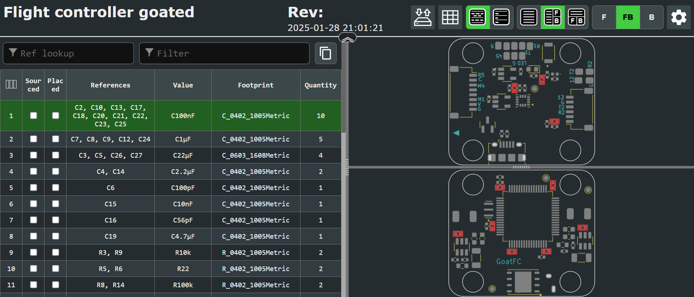

# 🐐 GoatFC-Bones - Open Source FPV Flight Controller

<div align="left">
  <p>
    <strong>GoatFC-Bones</strong> is a compact, cheap, open-source FPV drone flight controller designed for racing builds without sacrificing performance. It’s ideal for hobbyists who want simple hardware so that they can easily understand what is happening in their quadcopter.
  </p>
</div>


## 🔧 Key Features

- **Voltage Regulation:**
  - 5V and 12V BEC outputs
  - Dual 3.3V LDOs:
    - One dedicated to the IMU for **noise isolation**
    - One for the rest of the system

- **Connectivity:**
  - Micro-USB for configuration
  - 20x20mm standard mounting pattern
  - ESC connector for clean wiring
  - 6-pin HD video system plug

- **Software:**
  - Compatible with [Betaflight](https://betaflight.com/) no official target yet!

- **License & Use:**
  - **Open-source** – build it, modify it, improve it
  - **Non-commercial** – redistribution for sale is **not allowed**
## 🧷 Pinout Diagram

Below is the pinout for the GoatFC-Bones flight controller. Make sure to reference this schematic when wiring your components.


> ⚠️ **Note:** The dedicated 3.3V regulators *are* broken out on the board, but **they are not intended for external use**. If you're curious about their exact location or implementation, please refer to the KiCad design files. Avoid connecting anything to these lines unless you fully understand the design — using them improperly may cause instability or damage.


> 🔌 Always double-check with a multimeter before connecting components!
## 🛠️ Building Your Own GoatFC-Bones

Amazing that you want to build one!

You can order the PCBs from your favorite PCB manufacturer — the Gerber files are available in the folder:  
[Gerber Files Folder](./gerber%20files)

### 📦 Bill of Materials (BOM)

The BOM is provided as an **interactive BOM**, which you can view here:  
[Download and open html file here](./interactive-bom)



The iBOM makes it easy to locate and identify all the required components. Just search for the parts and order them from your preferred distributor.

### 🔧 Assembly Tips

- Solder all components following the iBOM placement guide
- Use **solder paste** and a **hot air station** for best results
- All components are **0402 size** — small, but manageable with some patience
- If you're new to SMD soldering, it's a good idea to practice on a scrap board first!

Good luck, and enjoy flying with your custom GoatFC-Bones FC!

## Flashing Betaflight to GoatFC-Bones

Follow these steps to flash Betaflight firmware to your GoatFC-Bones flight controller:

### Requirements
- A fully assembled GoatFC-Bones FC
- [Betaflight Configurator](https://github.com/betaflight/betaflight-configurator/releases) (latest version) installed on your PC

### Flashing Steps

1. **Build and assemble** your GoatFC-Bones FC.
2. **Install the latest Betaflight Configurator** on your computer.
3. **Enter DFU mode**:
   - Hold down the **boot button** on the FC while plugging in the **Micro-USB** cable.
4. In Betaflight Configurator, your FC should now show up as **DFU Bootloader**.
5. Go to the **Firmware Flasher** tab.
6. Under **Board**, select:  
   **`FOXEERF722V4`** (GoatFC-Bones shares a pinout with the Foxeer Mini V4).
7. Choose your preferred **firmware version** from the dropdown.
8. Click **Load Firmware [Online]**.
9. Then click **Flash Firmware**.
10. Once flashing is complete, the firmware is installed and ready to go! 🎉

### ⚠️ Important: Motor Remapping Required

Because the motor layout on GoatFC-Bones differs from the Foxeer Mini V4, you must **remap the motors** in the CLI:

1. Go to the **CLI** tab
2. In the cli type:
```
resource MOTOR 1 PC08
resource MOTOR 2 PC09
resource MOTOR 3 PA08
resource MOTOR 4 PA09
save
```
4. Now your motors should be in the correct order.
- You only need to do this once — after that, you can **save your configuration as a preset** to reload easily next time.

> 💡 Tip: After remapping, test motor directions in the “Motors” tab and double-check the order before your first flight.

---

## ⚠️ Disclaimer

This project is provided **as-is** without any warranty or guarantee of functionality or safety.

By using the GoatFC-Bones design files, firmware configurations, or build instructions, you acknowledge and agree that:

- You are solely responsible for your own safety and the safety of others.
- You assume all risks associated with the assembly, flashing, and use of this hardware.
- I (the creator) am **not liable** for any damage, injury, loss, or malfunction resulting from the use, misuse, or failure of this project.
- Always follow proper electrical and flight safety practices, and ensure compliance with your local laws and regulations.

> 🚧 Use at your own risk. This is an open-source DIY project intended for educational and recreational purposes (drone racing an amazing hobby!).
